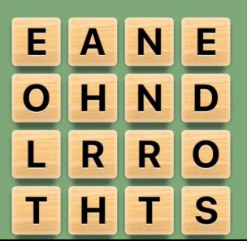
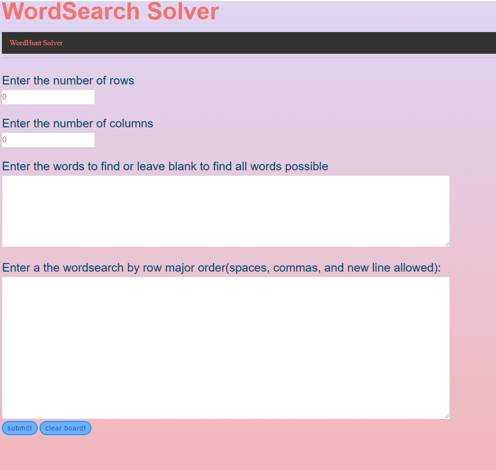
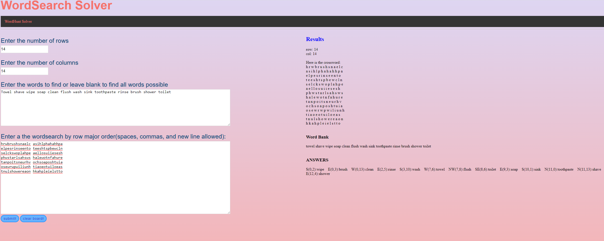
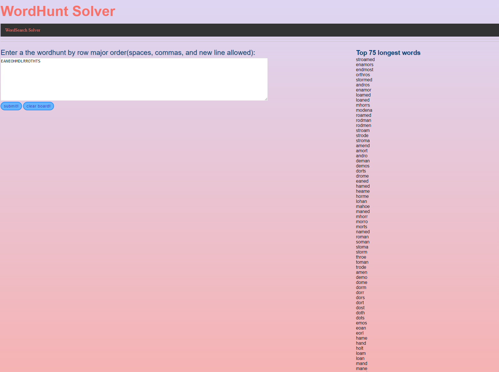

# Word Search and Word hunt solver
Solver for the famous game of word hunt on iphones and the classic word puzzle.
Uses DFS algorithm for wordhunt and linear algorithm for word puzzle

# Introduction
Word Search is a classic game played by many where you attemp to find words in four directions (up, down, left, right). Word Hunt extends this by making it possible to traverse any direction from any letter a head-to-head game where you try to find the most words as possible in a 4x4 grid with 90 seconds.  
Below is example of a word hunt grid and a word being found in a different grid  

# Description
This web application is a solver for both word search and word hunt  
Upon entering the website, users are greeted with the following home page   

# Examples
This is a 14x14 word search with a custom dictionary being solved  
 
 
 This is a word hunt game being solved  
 
